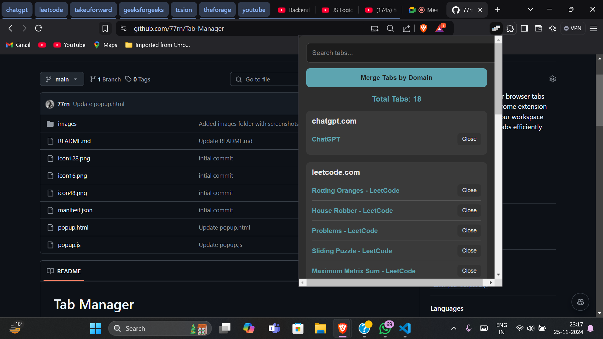

# Tab Manager  
Effortlessly manage your browser tabs with Tab Manager, a Chrome extension designed to declutter your workspace and help you navigate tabs efficiently.  

## Table of Contents  
- [Features](#features)  
- [Screenshots](#screenshots)  
- [Installation](#installation)  
- [How to Use](#how-to-use)  
- [Technologies Used](#technologies-used)  
- [Contributing](#contributing)  
- [License](#license)  

## Features  
- **Tab Grouping**: Organize tabs into meaningful categories for better productivity.  
- **Organized Tab Management**: Handle multiple open tabs effortlessly.  
- **Quick Navigation**: Jump directly to any tab without searching endlessly.  
- **Close, Reopen, or Save Tabs**: Seamlessly manage tabs without losing important ones.  
- **Lightweight and User-Friendly**: Simple and intuitive interface designed for everyone.  

## Screenshots  
### Popup Interface  
  

### Tab Grouping in Action  
  

## Demo Video  

## Installation  
1. Clone this repository:  
2.Open Google Chrome and navigate to chrome://extensions.
3. Enable Developer mode in the top-right corner.
4. Click Load unpacked and select the folder containing the cloned repository.
5. The Tab Manager extension is now installed! 🎉

## Technologies Used  
- **HTML**: For the structure of the popup.  
- **CSS**: For styling the interface.  
- **JavaScript**: To handle tab management functionality.  
- **Chrome Extensions API**: For interacting with browser tabs and implementing features.  

## Conclusion  
Thank you for checking out Tab Manager! 🌟  
If you find this project helpful, consider starring the repository and sharing it with others.  

Happy browsing! 🚀  
